# Goal For This Project 

Welcome to the "Olympic Quiz". This quiz aims to test your knowledge on the Olympic games.

Your knowledge will be put to the test against the clock as you have only 60 seconds to answer as many questions correctly as you can. Howevever, you must becareful because for each wrong answer you will be deducted 5 seconds from your remaining time. 

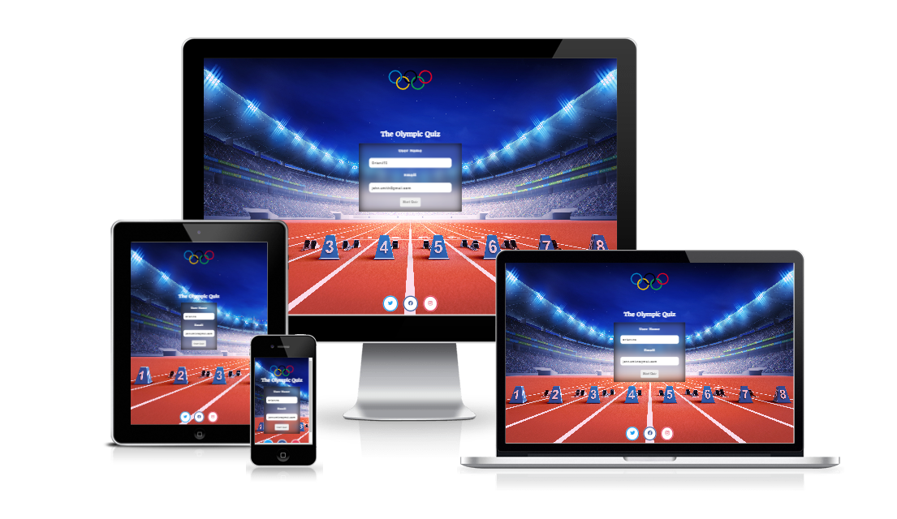

# Table of Contens 

* [UX](#ux "UX")
    * [User Goals](#user-goals "User Goals")
    * [User Stories](#user-stories "User Stories")
    * [Site Owner Goals](#site-owner-goals "Site Owner Goals")
* [Requirements and Expectations](#requirements-and-expectations "Requirements and Expectations")
    * [Requirements](#Requirments "Requirements")
    * [Expectations](#expectations "Expectations")
* [Design-Choices](#design-choices "Design Choices")
    * [Inspiration](#inspiration "Inspiration")
    * [Fonts](#fonts "Fonts")
    * [Images](#images "Images")
    * [Icons](#Icons "Icons")
    * [Colours](#colours "Colors")
    * [Structure](#structure "Structure")
* [Wireframes](#wireframes "Wireframes")
* [Features](#features "Features")
    * [Existing-Features](#existing-features "Existing Feautres")
        * [Navigation-Bar](#navigation-bar "Navigation Bar")
        * [Landing-page](#landing-page "Landing Page")
        * [Book-Now-Section](#book-now-section "Book Now Section")
        * [Location-Section](#location-section "Location Section")
        * [Booking-Form-Section](#booking-form-section "Booking Form Section")
        * [Gallery-Section](#gallery-section "Gallery Section")
        * [Footer](#footer-section "footer section")
    * [Features-To-Be-Implemented](#features-to-be-implemented "Features to be Implemented")
* [Technologies](#technologies "Technologies")
    * [Languages](#languages "Languages")
    * [Libraries-&-Frameworks](#libraries "Libraries & Frameworks")

# UX

## User Goals 

* A visually appealing landing page which clearly communicates the purpose of the site 
* A modal with instructions on how to play the quiz 
* Engaging and challenging questions 
* Results page to see how well you did in the quiz 
* Easy and intuitive navigation on all screen sizes

## User Stories 

* As a user, I want to be able to create a username 
* As a user, I want to see my total score at the end of the quiz 
* As a user, I want to have my time reduced for each incorrect answer I selected 
* As a user, I want to be able to access the quiz's social media accounts 
* As a user, I want to be able to restart the quiz once it is over 

## Site Owner Goals 

* Create a site that is intuitive to navigate for visitors 
* Provide users with feedback after they finish a quiz 
* Create a positive user experience through a visually appealing site 
* Capture user emails for email marketing purposes 

# Requirements and Expectations 

## Requirments 

* Mobile first design, which is responsive on all larger screens 
* The design uses a colour scheme which is easy to view 
* Before any user starts the quiz check if they understand the rules  
* After each question is answered the user is provided with feedback in the form of a visual que which highlights if they answered the question correctly 
* The user is deducted 5 seconds for every incorrect answer they select 
* The user is provided with a result at the end of their quiz 
* Social media accounts can be accessed via the footer of the site 

## Expectations 

* I expect to be able to see a result of how I did in the quiz 
* I expect the site to be easy to navigate 
* I expect to find information laid out in a logical and clear manner 
* I expect the quiz to include logic to negative mark me for submitting wrong answers 
* I expect that the site scales correctly on different size screens 

# Design Choices 

## Inspiration  
 
1. [Official Olympic Website](https://olympics.com/en/ "Official Olympic Website") 

    * The logo of the site will be used as the favicon for this site 
    * The logo of this site will be used as inspiration for this site 

## Fonts

I have used google fonts to select a font type that best supports the goals of the website. For the main text I have selected [Judson](https://fonts.google.com/specimen/Judson?preview.text=test&preview.text_type=custom&query=Judson#styles "Judson") because the rounded edges portray an approachable brand. To make the headers and the navigation bar stand out from the text, I decided to use [Quando](https://fonts.google.com/specimen/Quando?preview.text=test&preview.text_type=custom&query=quando "Quando").

## Images

It is important that the large background image used in the hero section portrays an athlete to highlight the purpose of the site which is a sport quiz 

Again, images associated with the Olympic will be used in the background of the section which includes the form on the landing page and of the page which includes the leader board 

## Icons

The font awesome library will be used throughout the site for social media links and to provide visual aids for the results of questions and to provide overall feedback on the user’s quiz. All icons will be consistent with the style of the Olympic brand. 

## Colours 

The inspiration for the colours was taken from the Olympic logo. I used the website [colourmind](http://colormind.io/ "colourmind") to pick the specific shades for this colour scheme. I tested the colours I selected on the [WebAIM](https://webaim.org/ "WebAIM") contract checker which showed that they have no contrast issues. 

## Structure

I will be building my website with a mobile first mindset using the iPhone 5/SE (320px) as the smallest screen size for styling to look good on. The screen size breakpoints that I will be using are from [Bootstrap breakpoints](https://getbootstrap.com/docs/5.0/layout/breakpoints/ "Bootstrap breakpoints").

| Screen Size | Breakpoint |
| ----------- | ---------- |
| x-small     | <576px     |
| small       | => 576px   |
| medium      | => 768px   |
| large       | => 992px   |
| x-large     | => 1200px  |

# Wireframes 

I have used [Balsamic](https://balsamiq.com/wireframes/ "Balsamic") to develop my wireframes for my website. I initially created the mobile version of the wireframes and then designed what the site would look like on larger devices. I did not create a design for each size listed in the structure section, the mobile wireframes cover x-small and small, the tablet covers medium and the desktop covers large and x-large. 

The wireframes are below:

### [Mobile Wireframes](docs-readme/mobiles-wireframes.pdf "Mobile Wireframes")
### [Tablet Wireframes](docs-readme/tablet-concept.pdf "Tablet Wireframes")
### [Desktop Wireframes](docs-readme/desktop-concept.pdf "Desktop Wireframes")

# Features 

## Existing Features 

### Logo with link back to home page 

The site's header remains clean and simple. The only item within it is the site logo. 

The logo has two sizes 

1) Medium to large devices 

2) Small

Clicking on the logo will link you to the home page of the site

### Start Quiz Form

The form on the site includes only two fields:

1. The username
2. The Email address 

The form field username will default be autofocused, so the cursor is displayed inside this field when the site is loaded. 

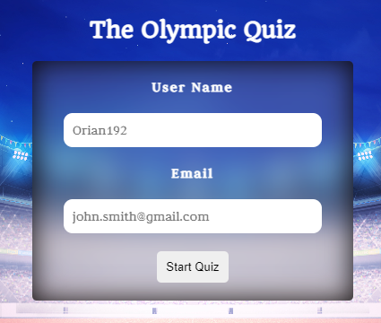

Both of these fields are required. If a user attempts to submit the form without occupying either field, the form will prevent them from doing so, and an error message will be displayed. 

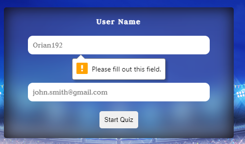

Furthermore, the form applies validation to the email field, which prevents the form from being submitted unless the value entered follows a valid email format. 

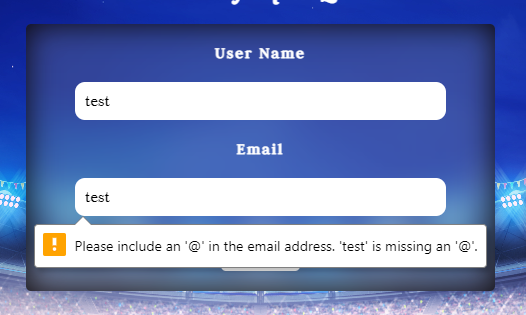

### Start Quiz Form Button

Once the form fields are populated the user can click the button labeled "start quiz". This button will call a function that hides the content initially displayed on the home screen i.e. the form. The same function will display content that checks if the user has read the rules of the quiz and fully understands them. 

### Before you play 

This content is displayed after the user submits the form. The section will prevent users from starting the quiz before the understand the rules.The section displays two buttons:

1. The How to play will button will display a modal that includes the rules of the quiz 
2. The Start Quiz button will display the quiz and hide the this content 

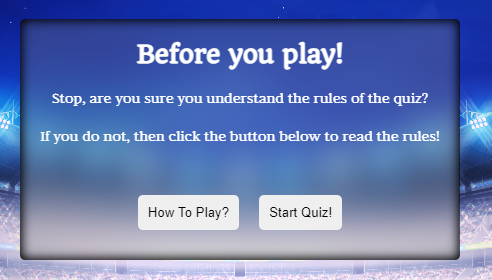

### How to play Module 

The rules modal is displayed only when the user clicks the "How to play" button. 

The rules modal includes four bullet points, with icons to help the user visually understand the rules. 

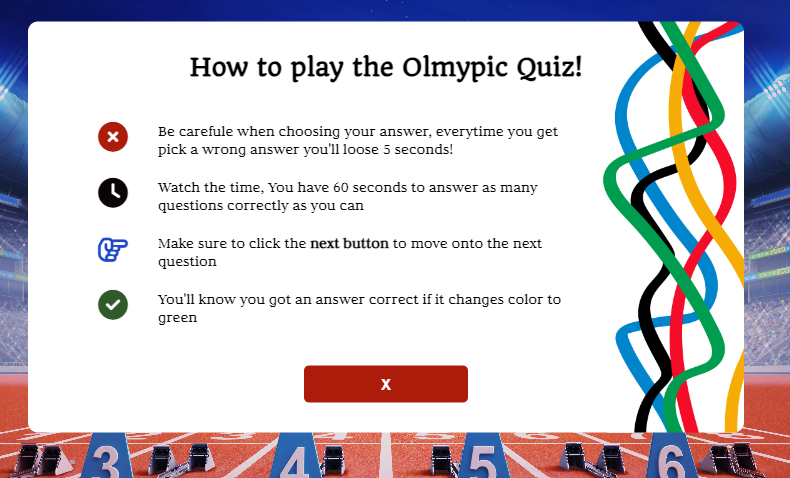

The user can click the "X" button to close the modal.

The modal and its contents, like the close button, scale in size depending on the device's size, i.e. the below image is the same as above but on a mobile.

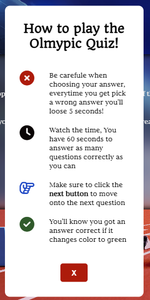

### Quiz displayed

The second button on the how to play check, "Start Button", will hide the content currently displayed and display the quiz contents. 

The quiz contains the following components:

1. The question 
2. The timer
3. The possible answers  
4. Correct and incorrect score counters 
5. Next button 

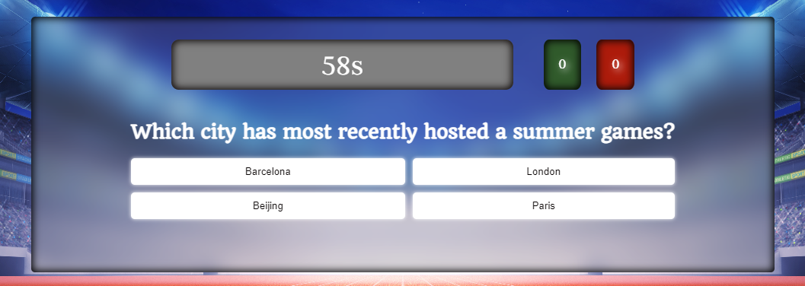

### Timer 

The timer is contained in a box with a grey box and an inset box shadow effect. 

The initial value of the timer is set at sixty seconds, and as soon as the quiz is displayed, a function begins to deduct one unit from the original value every second. 

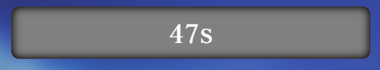

#### > 15 seconds 

When the value of the timer falls below fifteen seconds, the colour of the font will change from white to red to highlight to the user that their time is nearly out. 

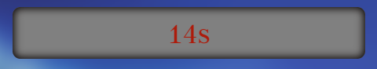

#### incorrect answer 

If the user selects an incorrect answer, the timer will flash red for one second and display a value of "-5",  highlighting that the timer was reduced by five seconds for incorrectly selecting the incorrect answer 

### Score Counters

The two score counters are identifiable by their background colour:

1. The incorrect score counter has a background colour of red
2. The correct score counter has a background colour of green

For each correct/incorrect answer selected, the relevant counter will increase by a value of one

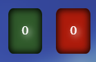

### Questions  

The questions are styled in H2 and are positioned above the answer boxes. 

The questions are in a JSON file. A fetch function gets the array once the site is loaded. A random question is displayed when the quiz starts and when a user clicks the next button. 

### Possible answers

Four possible answers are displayed with each question. 

The four answers are stored in the JSON array with the questions. Every time the next button is clicked, the four answers associated with the randomly selected questions are displayed.

Once an answer is selected it is disabled and cannot be selected again, this prevents users from being negatively impacted for accidently selecting the same incorrect asnwer twice. 

#### large screens 

On a large screen the questions are presented to the user in a 2 x 2 grid. The buttons also have an active pseudo effect applied so it looks like the user is pressing button down when they click. 

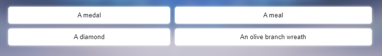

#### Medium to Small Screens 

On a small to medium screens the questions are presented to the user in a single column 

### Next button 

The next button is dispalyed only after a correct answer is selected. This prevents users from skipping a question and avoiding the penalty of selecting an incorrect answer. 

Before an answer is selected and when only an incorrect answer has been selected the next button will not be displayed

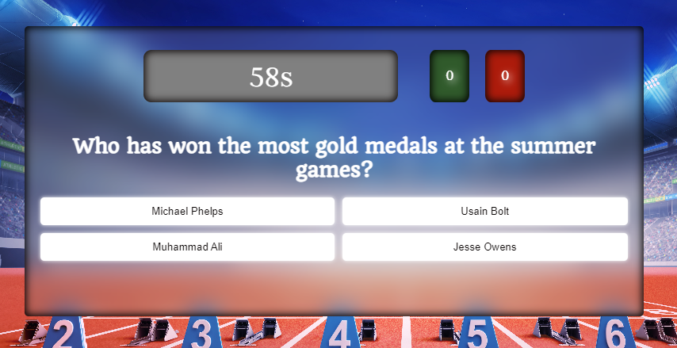

### Results Modal 

Once the timer reaches a value of 0 the results modal will display. The contnets of the results modald will change depending on the number of correct answers acheived by the user. 

Eeach of the results messages will include three of the same variables 

1. The number of selected answers that were correct
2. The number of selected answers that were incorrect
3. The total amount of time lost by the user for incorrect answers 

#### Below 5 

The icon presented to the user will be bronze and the message will encourage the user to brush up on their knowledge of the Olympic games

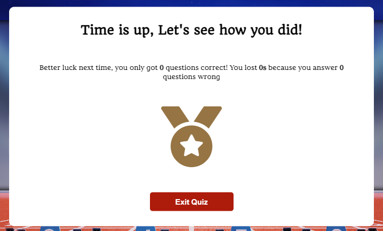

#### Between 5 and 10 

The icon presented to the user will be silver and the message will congratulate the user for getting a respectable score 

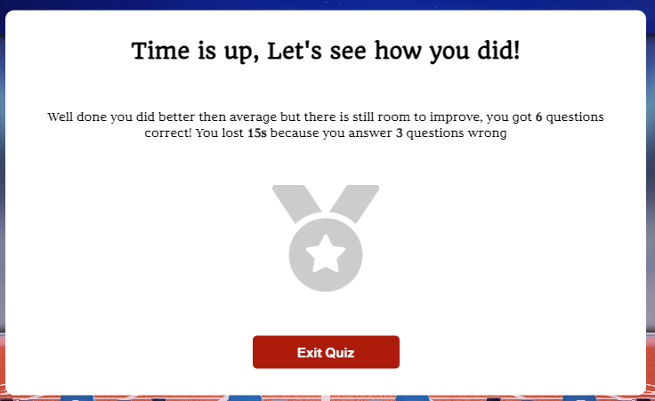

#### Above 10 

The icon presented to the user will be gold and the message will congratulate the user for getting an impressive score 

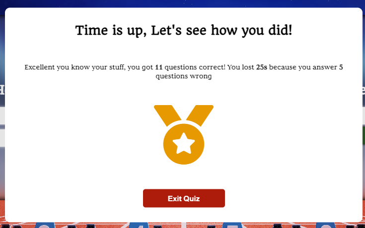

### Social media icons 

The site's footer remains uncluttered and includes only the social media icons and links for the three platforms:

1. Facebook
2. Twitter
3. Instagram

Clicking on any of the icons will link you to that specific social media site in a new tab

#### Medium to Large Screens 

The social media icons will change colour if the user hovers over the icon. The colours will invert. The background colour will change to white, and the font colour will change to the original colour of the background. 

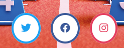

#### Small Screens

The default style of the icons on smaller devices is the inverted style on larger devices.  It would be incorrect to apply the hover effect on mobile devices because once it is used, the user can only remove it by refreshing the page, creating a poor user experience. 

## Features to be implemented 

### Leaderboard

A leaderboard would increase the gamification of the quiz by adding an element of competiviness. It would more likely to see repeat visitors to teh quiz as users return in an attempt to maintain their position on the leaderboard.

### Personalised user dashboard

The signup form captures both the username and email address of the user, this create an oportunity to provide the user with a personalised dashboard. During each session the users results could be printed to this dashboard, a personalised welcome message could be created and from the dasboard the user would be able to select the dificulty level of the quiz. 

### Different levels of difficulty 

Currently, the quiz pulls random questions from a set of 20 questions stored in a JSON file. There is no categorisation based on their dificulty. 

In the future multiple JSON files could be created, each file would contain a set of questions based on their diificulty rating, and the fetch function would call a particular file based on the level the user selects.  

### Timer bar 

In this quiz the timer has a simple design, if I had more time I would have added a progress tracker that reduced in height as the timer approached zero. 
### Animations on answers 

On selection the answers simply change color but if I had more time I would have added an animation so that when a user slected an answer it would flip over and display an icon that would make it clear if the user selected the correct/incorrect answer i.e. check/ x icon 

# Technologies 

## Languages 

* [HTML](https://en.wikipedia.org/wiki/HTML "HTML")
* [CSS](https://en.wikipedia.org/wiki/CSS "CSS")

## Libraries 

* [Google Fonts](https://fonts.google.com/ "Google Fonts")
* [Font Awesome](https://fontawesome.com/ "Font Awesome")

## Tools 

* [Gitpod](https://www.gitpod.io/ "Gitpod")
* [Github](https://github.com/ "Github")
* [Balsamic](https://balsamiq.com/wireframes/ "Balsamic")
* [W3C HTML Validation Service](https://validator.w3.org/ "W3C HTML Validation Service")
* [W3C CSS Validation Service](https://jigsaw.w3.org/css-validator/ "W3C CSS Validation Service")
* [Colourmind](http://colormind.io/ "Colourmind")
* [Font Awesome](https://fontawesome.com/ "Font Awesome")
* [Google Fonts](https://fonts.google.com/ "Google Fonts")
* [Pexles](https://www.pexels.com/ "Pexles")
* [Chrome Dev Tools](http://colormind.io/ "Chrome Dev Tools")
* [WebAim](https://webaim.org/resources/contrastchecker/ "WebAim")
* [Adobe Stock Images](https://stock.adobe.com/ie/ "Adobe Stock Images")
* [Am I Responsive](https://ui.dev/amiresponsive "Am I Responsive")

# Testing 

## Tests

### WC3 Markup Validator 

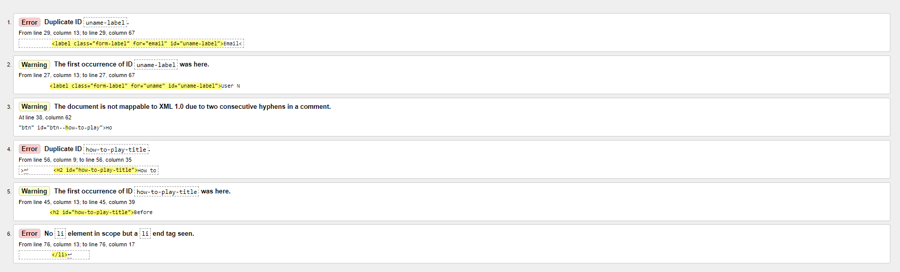

### WC3 CSS Validator 

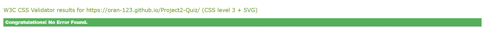

### Light house test 

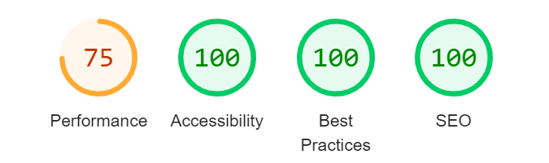

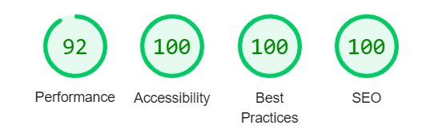

### WebAim Contrast Test 

## Bugs 

## Unfixed Bugs

### mobile layout 

on some mobile devices the layout is displayed before the relevant java script function is called to display it. 

### backdrop filter mobile 

The backdrop filter does not seem to work as well on mobile devices, the blur effect is severly reduced. 

### buttons mobile 

The buttons do not have the same style on mobile devices as they do on desktop. 

### timer 

Every second the value of the timer is reduced by 1, and if the user answers a question incorrectly they are deducted five seconds off of their current time. The timer background color changes to red and the value changes to -5 when the user answers a question incorrectly. However, if the user answers a question towards the end of the one second interval then the value of -5 is displayed for less then a second. 

# Deployment

# Credits 

For code inspiration:

* https://www.youtube.com/@WebDevSimplified 
* 

For content and style inspiration: 
